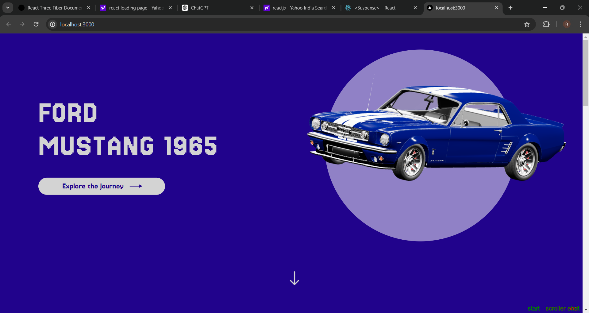

# Mustang Showcase Website

A visually immersive, scroll-driven 3D website built to showcase the legendary **1965 Ford Mustang**. This project combines creative web animation with 3D rendering to deliver an engaging storytelling experience around an iconic car model. This site allows users to explore a highly detailed 3D model of the Ford Mustang with smooth scroll-triggered animations. Ideal for car enthusiasts, digital showrooms, or automotive portfolios.

## Live on [https://mustang-neon.vercel.app/](https://mustang-neon.vercel.app/)

##  Features

-  Scroll-based animations with GSAP ScrollTrigger
-  Custom lighting, reflections, and camera transitions
-  Fast-loading 3D assets using optimized GLTF models

##  Technologies Used

- [React Three Fiber](https://github.com/pmndrs/react-three-fiber)
- [Three.js](https://threejs.org/)
- [GSAP & ScrollTrigger](https://greensock.com/scrolltrigger/)
- [Next.js](https://nextjs.org/) 
- [React.js](https://react.dev/) 
- [Drei](https://github.com/pmndrs/drei)

## Screenshots


Clone the repository:

```bash
git clone https://github.com/Rajnish8292/mustang.git
cd mustang
```

Install Dependencies : 
```bash
npm install
# or
yarn install
```

Run the development server : 
```bash

npm run dev
# or
yarn dev
```

Open http://localhost:3000 to view the website in your browser

## Author
Made by Rajnish Raj
### Connect on [LinkedIn](https://www.linkedin.com/in/rajnish-raj-9139602a4/)


